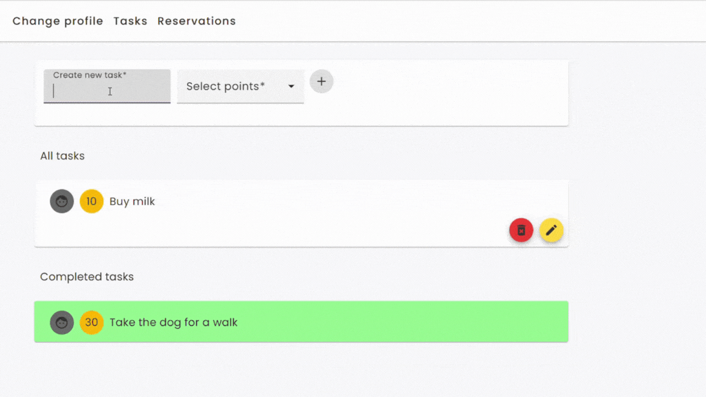
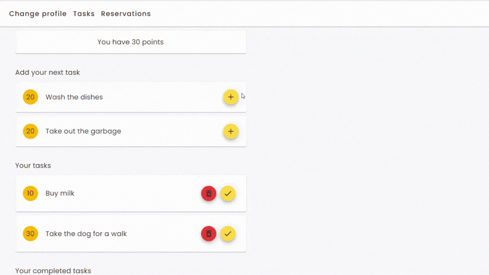

# **Clean And Play**

## **About**

Clean and Play is an application for families that helps to manage household chores and time spent on the computer.

## **Technologies**

- Angular: Routing, Services, HttpClient, NgForm, Observable, Subject, Input, Output, ngFor, ngIf
- Angular Material: Card, Button, Input, Datepicker, Icon, Tooltip
- json-server npm

## **Features**

Two types of account:

1. **Parent** account features:

- add a new task: name and points to collect.
- delete or rename a task
- see all tasks with details: points, owner, full status
- add a new reservation to play computer games
- see all bookings with details

2. **Child** account feature:

- see tasks that you can add to your to-do list
- see the list with tasks to be done
- add, delete and mark as done
- add or delete computer reservations
- see own bookings with details
- see points to use

## **Run json-sever**

Run `npm run api` to start json-server.

## **Development server**

This project was generated with [Angular CLI](https://github.com/angular/angular-cli) version 15.0.4.

Run `ng serve` for a dev server. Navigate to `http://localhost:4200/`. The application will automatically reload if you change any of the source files.

## **Code scaffolding**

Run `ng generate component component-name` to generate a new component. You can also use `ng generate directive|pipe|service|class|guard|interface|enum|module`.

## **Build**

Run `ng build` to build the project. The build artifacts will be stored in the `dist/` directory.

## **Running unit tests**

Run `ng test` to execute the unit tests via [Karma](https://karma-runner.github.io).

## **Running end-to-end tests**

Run `ng e2e` to execute the end-to-end tests via a platform of your choice. To use this command, you need to first add a package that implements end-to-end testing capabilities.

## **Further help**

To get more help on the Angular CLI use `ng help` or go check out the [Angular CLI Overview and Command Reference](https://angular.io/cli) page.
